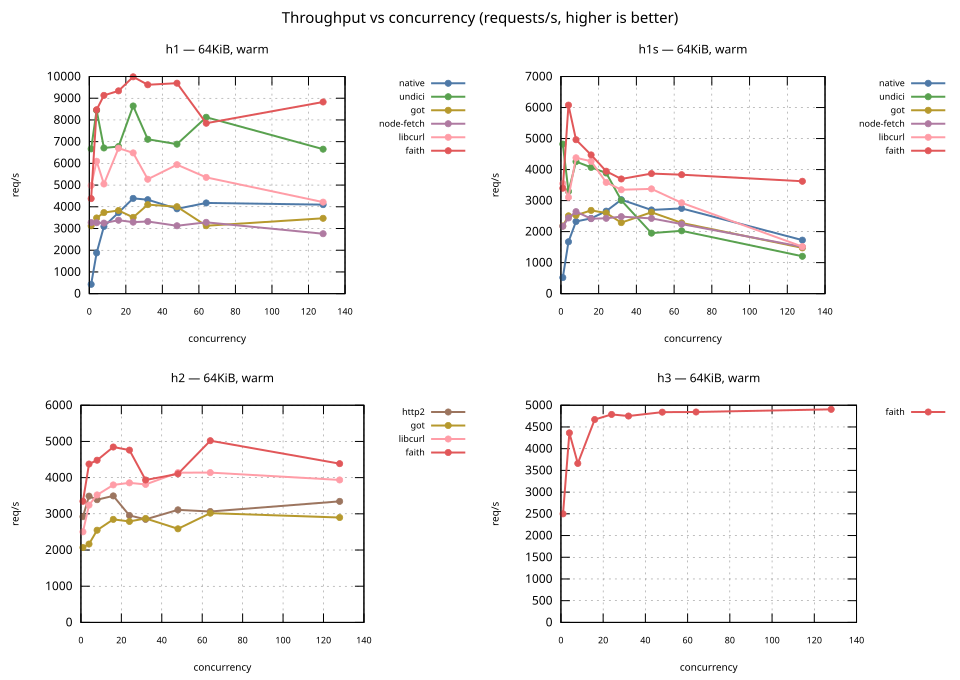
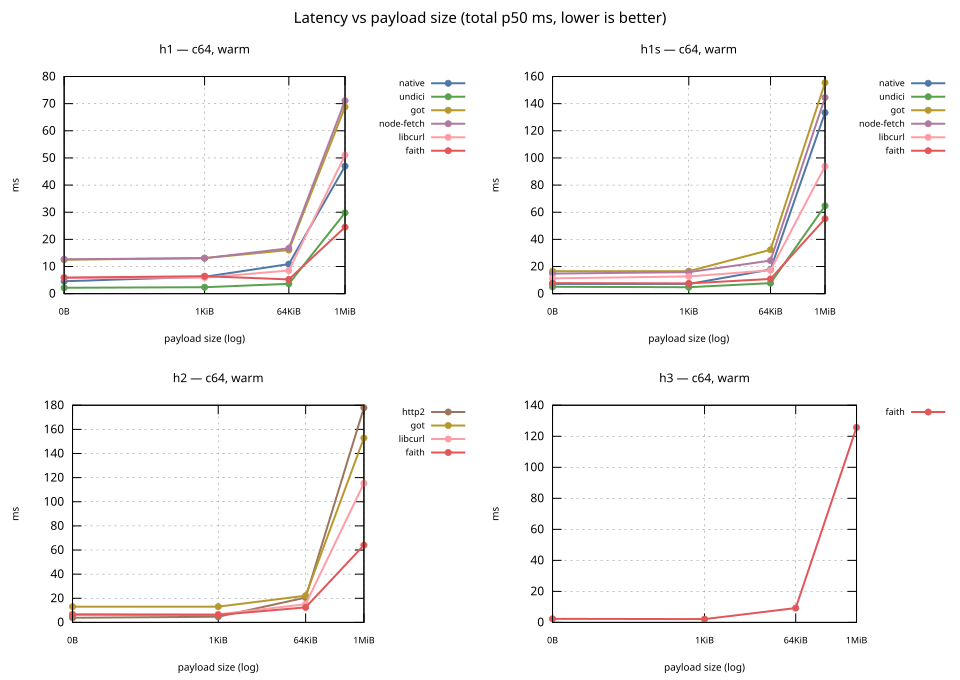
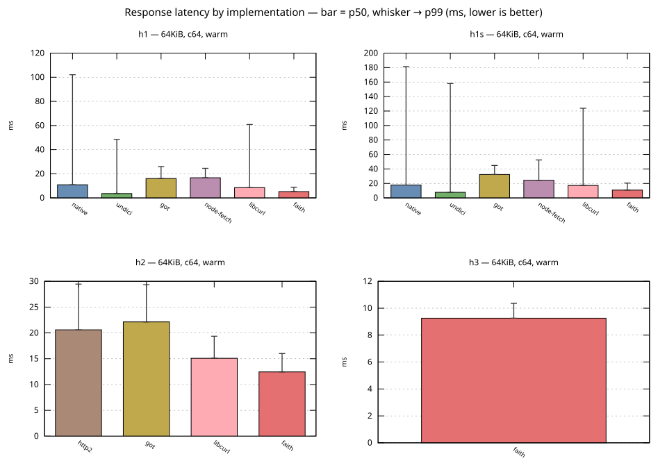
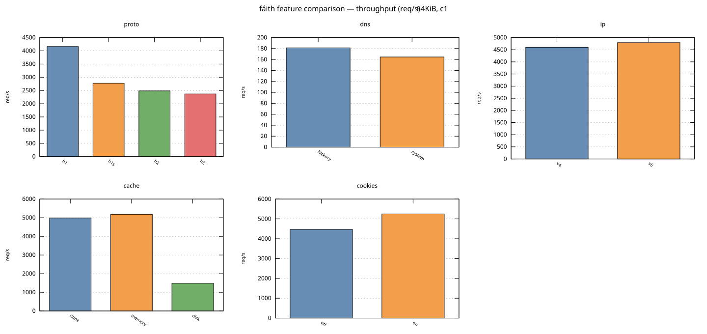

# fáith - Rust-powered fetch API for Node.js

/ˈɸaːθj/ — pronounced FATH, like FATHER without the ER. This is an old irish word that is a folk
etymology of "fetch", and means _poet_, _soothsayer_, _seer_, and later, _prophet_.

Fáith is of course a pun with _faith_, and is meant to be a _faithful_ implementation of the fetch
API for Node.js, but using a Rust-based network stack instead of undici + libuv.

Most `fetch` implementations for Node.js are based on the Node.js TCP stack (via libuv) and cannot
easily work around its limitations. The native fetch implementation, `undici`, explicitly targets
HTTP/1.1, and doesn't support HTTP/2+, among many other complaints (of course, for HTTP/1, undici
is a very good effort! it just feels like a bit of an outdated choice today).

Fáith tries to bring a Node.js fetch that is closer to the browser's fetch, notably by having
transparent support for HTTP/2 and HTTP/3, IPv6 and IPv4 using the "Happy Eyeballs" algorithm, a
DNS cache, an optional cookie jar, and your choice of two HTTP caches.

### 📐 Is it faster?

Yes, except if you create one `Agent` for every new request. This is something that we deliberately
do not optimise for, and you do need to go out of your way to use it like that. Additionally, fáith
does have the real cost of not being built-in, and being a native module, not pure JS: so you can't
use it outside of Node.js and in constrained environments.

[](./bench/concurrency-throughput.svg)

[](./bench/latency-vs-size.svg)

[](./bench/latency-by-impl.svg)

[](./bench/features-rps.svg)

### 🧪 Is it correct?

Yes. We maintain a suite of tests across actual servers and topologies, exercising the different
protocol features fáith will encounter in real-life usage. Few servers support the full list, but
whatever servers emit, fáith must correctly handle. So far, everything we've tested works:

<!-- conformance:start -->

| | node-h1 | node-h2 | caddy | nginx | apache-h1 | apache-h2 | haproxy-h1 | haproxy-h2 | quiche |
| --- | --- | --- | --- | --- | --- | --- | --- | --- | --- |
| **trailers** | ● | ● | · | · | · | · | ● | ● | · |
| **chunked bodies** | ● | · | · | · | · | · | ● | · | · |
| **gzip** | ● | ● | ● | ● | ● | ● | ● | ● | · |
| **conditional GET** | ● | ● | ● | ● | ● | ● | ● | ● | · |
| **protocol negotiation** | · | · | ● | ● | · | ● | · | ● | · |
| **connection reuse** | ● | · | · | · | ● | · | · | · | · |
| **oversized headers** | ● | · | · | ● | ● | ● | · | · | · |
| **h2 GOAWAY** | · | ● | · | · | · | · | · | · | · |
| **HTTP/3** | · | · | ● | ● | · | · | · | · | ● |
| **HTTP/3 upgrade** | · | · | ● | ● | · | · | · | · | · |

● covered  
· not applicable to this server  

<!-- conformance:end -->

## Installation

```bash
npm install @passcod/faith
```

## Usage

### Basic fetch

```javascript
import { fetch } from '@passcod/faith';

async function example() {
  const response = await fetch('https://httpbin.org/get');
  console.log(response.status); // 200
  console.log(response.ok); // true

  const data = response.json();
  console.log(data.url); // https://httpbin.org/get
}
```

### Fetch with options

```javascript
import { fetch } from '@passcod/faith';

const response = await fetch('https://httpbin.org/post', {
  method: 'POST',
  headers: {
    'Content-Type': 'application/json',
    'X-Custom-Header': 'value'
  },
  body: JSON.stringify({ message: 'Hello' }),
});
```

### Fetch with HTTP cache

```javascript
import { fetch, Agent } from '@passcod/faith';

const agent = new Agent({
  cache: {
    store: 'memory',
  },
});
const response = await fetch('https://httpbin.org/post', {
  agent,
  method: 'POST',
  headers: {
    'Content-Type': 'application/json',
    'X-Custom-Header': 'value'
  },
  body: JSON.stringify({ message: 'Hello' }),
});
```

# API Reference

Conforms to the [fetch API](https://developer.mozilla.org/en-US/docs/Web/API/Fetch_API).

In the following documentation, italics are parts that are *identical to how native fetch works*
(as per MDN), and non-italics document where behaviour varies and is specific to fáith (unless
otherwise specified).

This reference describes how to use the API. For what fáith requires of itself, including the
standards it answers to and the points where it knowingly diverges from them, see the
[specs](./.workhorse/specs/overview.md).

## `fetch()`

### Syntax

```javascript
import { fetch } from '@passcod/faith';
fetch(resource);
fetch(resource, options);
```

### Parameters

#### `resource`

*This defines the resource that you wish to fetch. This can either be:*

- *A string or any other object with a stringifier — including a `URL` object — that provides the
  URL of the resource you want to fetch.* The URL must be absolute and include a scheme.

- *A `Request` object.*

#### `options` (Optional)

*A `RequestInit` object containing any custom settings that you want to apply to the request.* In
practice the `RequestInit` class does not exist in browsers or Node.js, and so this is always a
"plain object" or "dictionary". The fields supported by Fáith are documented below.

### Return value

*A `Promise` that resolves to a `Response` object.*

<!-- //full duplex mode is not yet implemented//
In `half` duplex mode (the default), the promise resolves when the request body has been fully sent
and the response headers have been received. In `full` duplex mode (supported by Fáith but not yet
browsers), the promise resolves as soon as response headers have been received, even if the request
body has not yet finished sending. Most HTTP servers will not send response headers until they've
finished receiving the body so this distinction doesn't matter, but some do, and it is possible to
take advantage of this behaviour with `full` duplex mode for decreased latency in specific cases.
You may even be able to vary the request body stream based on the response body stream.
-->

## `Request`

Fáith does not implement its own `Request` object. Instead, you can pass a Web API `Request` object
to `fetch()`, and it will internally be converted to the right options.

## `RequestInit` object

*The `RequestInit` dictionary of the Fetch API represents the set of options that can be used to
configure a fetch request.*

*You can pass a `RequestInit` object into the `Request()` constructor, or directly into the
`fetch()` function call.* Note that Fáith has additional options available, and those will not
survive a trip through `Request`. Prefer to supply `RequestInit` directly to `fetch()`.

*You can also construct a `Request` with a `RequestInit`, and pass the `Request` to a `fetch()`
call along with another `RequestInit`. If you do this, and the same option is set in both places,
then the value passed directly into `fetch()` is used.*

Note that you can include options that Fáith does not support; they will simply be ignored.

### `FetchOptions.agent: Agent`

This is custom to Fáith.

You can create an `Agent`, and pass it here to have the request executed by the `Agent`. See the
documentation for the `Agent` options you can set with this, and the agent data you can access.
Notably an agent has a DNS cache, and may be configured to handle cookies and/or an HTTP cache.

When not provided, a global default `Agent` is created on first use.

### `FetchOptions.attributionReporting`

Fáith deliberately does not implement this.

### `FetchOptions.body`

*The request body contains content to send to the server, for example in a `POST` or `PUT` request.
It is specified as an instance of any of the following types:*

- *a string*
- *`ArrayBuffer`*
- *`Blob`*
- *`DataView`*
- *`File`*
- *`FormData`*
- *`TypedArray`*
- *`URLSearchParams`*
- *`ReadableStream`*

*If `body` is a `ReadableStream`, the `duplex` option must also be set.*

### `FetchOptions.browsingTopics`

Fáith deliberately does not implement this.

### `FetchOptions.cache`

*The cache mode you want to use for the request. This may be any one of the following values:*

- *`default`: The client looks in its HTTP cache for a response matching the request.*
  - *If there is a match and it is fresh, it will be returned from the cache.*
  - *If there is a match but it is stale, the client will make a conditional request to the remote
    server. If the server indicates that the resource has not changed, it will be returned from the
    cache. Otherwise the resource will be downloaded from the server and the cache will be updated.*
  - *If there is no match, the client will make a normal request, and will update the cache with
    the downloaded resource.*

- *`no-store`: The client fetches the resource from the remote server without first looking in the
  cache, and will not update the cache with the downloaded resource.*

- *`reload`: The client fetches the resource from the remote server without first looking in the
  cache, but then will update the cache with the downloaded resource.*

- *`no-cache`: The client looks in its HTTP cache for a response matching the request.*
  - *If there is a match, fresh or stale, the client will make a conditional request to the remote
    server. If the server indicates that the resource has not changed, it will be returned from the
    cache. Otherwise the resource will be downloaded from the server and the cache will be updated.*
  - *If there is no match, the client will make a normal request, and will update the cache with
    the downloaded resource.*

- *`force-cache`: The client looks in its HTTP cache for a response matching the request.*
  - *If there is a match, fresh or stale, it will be returned from the cache.*
  - *If there is no match, the client will make a normal request, and will update the cache with
    the downloaded resource.*

- *`only-if-cached`: The client looks in its HTTP cache for a response matching the request.*
  - *If there is a match, fresh or stale, it will be returned from the cache.*
  - *If there is no match, a network error is returned.*

- `ignore-rules`: Custom to Fáith. Overrides the check that determines if a response can be cached
  to always return true on 200. Uses any response in the HTTP cache matching the request, not
  paying attention to staleness. If there was no response, it creates a normal request and updates
  the HTTP cache with the response.

### `FetchOptions.credentials: string`

*Controls whether or not the client sends credentials with the request, as well as whether any
`Set-Cookie` response headers are respected. Credentials are cookies, ~~TLS client certificates,~~
or authentication headers containing a username and password. This option may be any one of the
following values:*

- *`omit`: Never send credentials in the request or include credentials in the response.*
- ~~`same-origin`~~: Fáith does not implement this, as there is no concept of "origin" on the server.
- *`include`: Always include credentials,* ~~even for cross-origin requests.~~

Fáith ignores the `Access-Control-Allow-Credentials` and `Access-Control-Allow-Origin` headers.

Fáith currently does not `omit` the TLS client certificate when the request's `Agent` has one
configured. This is an upstream limitation.

If the request's `Agent` has cookies enabled, new cookies from the response will be added to the
cookie jar, even as Fáith strips them from the request and response headers returned to the user.
This is an upstream limitation.

Defaults to `include` (browsers default to `same-origin`).

### `FetchOptions.duplex: string`

*Controls duplex behavior of the request. If this is present it must have the value `half`, meaning
that Fáith will send the entire request before processing the response.*

*This option must be present when `body` is a `ReadableStream`.*

### `FetchOptions.headers: Headers | object`

*Any headers you want to add to your request, contained within a `Headers` object or an object
literal whose keys are the names of headers and whose values are the header values.*

Fáith allows all request headers to be set (unlike browsers, which [forbid][1] a number of them).

[1]: https://developer.mozilla.org/en-US/docs/Glossary/Forbidden_request_header

### `FetchOptions.integrity: string`

*Contains the subresource integrity value of the request.*

*The format of this option is `<hash-algo>-<hash-source>` where:*

- *`<hash-algo>` is one of the following values: `sha256`, `sha384`, or `sha512`*
- *`<hash-source>` is the Base64-encoding of the result of hashing the resource with the specified
  hash algorithm.*

Multiple space-separated values are supported; if any matches, verification passes. Unknown
algorithms are silently ignored (but if all algorithms are unknown, an error is thrown).

Fáith only checks the integrity when using `bytes()`, `json()`, `text()`, `arrayBuffer()`, and
`blob()`. Verification when reading through the `body` stream is not currently supported.

Note that browsers will throw at the `fetch()` call when integrity fails, but Fáith will only throw
when the above methods are called, as until then the body contents are not available.

### `FetchOptions.keepalive`

Not supported.

Note that this is different from `Connection: keep-alive`; Fáith connections are pooled within each
single `Agent`, so subsequent requests to the same endpoint are faster until the pooled connection
times out. The `keepalive` option in browsers is instead a way to send a `fetch()` right before the
page is unloaded, for tracking or analytics purposes. This concept does not exist in Node.js.

### `FetchOptions.method: string`

*The request method. Defaults to `GET`.*

### `FetchOptions.mode`

Fáith deliberately does not implement this, as there is no CORS/origin.

### `FetchOptions.priority: "high" | "low" | "auto"`

*A hint of how this request ranks against others.*

Browsers use this option to prioritise streams. Fáith sends it as the [RFC 9218] `Priority` header
and lets the server schedule, which is what HTTP/2 and HTTP/3 servers act on.

Urgency runs from 0 (most urgent) to 7 (least urgent), and a request without the header is served at
the default urgency of 3.

- `high` sends `Priority: u=1`
- `low` sends `Priority: u=5`
- `auto` sends no header, leaving the request at the default urgency

A `Priority` header you set yourself, on the request or as an `Agent` default header, is sent as
written and no value is derived from this option.

[RFC 9218]: https://www.rfc-editor.org/rfc/rfc9218.html

### `FetchOptions.redirect`

Fáith does not respect this option on the `RequestInit` dictionary. Instead, the option is present
on `Agent` and applies to all requests made with that `Agent`.

### `FetchOptions.referrer`

Fáith deliberately does not implement this, as there is no origin.

However, Fáith does set the `Referer` header when redirecting automatically.

### `FetchOptions.referrerPolicy`

Fáith deliberately does not implement this, as there is no origin.

However, Fáith does set the `Referer` header when redirecting automatically.

### `FetchOptions.signal: AbortSignal`

*An `AbortSignal`. If this option is set, the request can be canceled by calling `abort()` on the
corresponding `AbortController`.*

### `FetchOptions.timeout: number`

Custom to Fáith. Cancels the request after this many milliseconds.

This will give a different error to using `signal` with a timeout, which might be preferable in
some cases. It also has a slightly different internal behaviour: `signal` may abort the request
only until the response headers have been received, while `timeout` will apply through the entire
response receipt.

## `Response`

*The `Response` interface of the Fetch API represents the response to a request.*

Fáith does not allow its `Response` object to be constructed. If you need to, you may use the
`webResponse()` method to convert one into a Web API `Response` object; note the caveats.

### `Response.body: ReadableStream | null`

*The `body` read-only property of the `Response` interface is a `ReadableStream` of the body
contents,* or `null` for any actual HTTP response that has no body, such as `HEAD` requests and
`204 No Content` responses.

Note that browsers currently do not return `null` for those responses, but the spec requires it.
Fáith chooses to respect the spec rather than the browsers in this case.

A response has one body stream: it is built on first access and the same stream is returned
thereafter, so reading through it advances a single position. Use `clone()` to get a second full
read of the body.

### `Response.bodyUsed: boolean`

*The `bodyUsed` read-only property of the `Response` interface is a boolean value that indicates
whether the body has been read yet.*

In Fáith, this indicates whether the body stream has ever been read from or canceled, as defined
[in the spec](https://streams.spec.whatwg.org/#is-readable-stream-disturbed). Note that accessing
the `.body` property counts as a read, even if you don't actually consume any bytes of content.

### `Response.headers: Headers`

*The `headers` read-only property of the `Response` interface contains the `Headers` object
associated with the response.*

Note that Fáith does not provide a custom `Headers` class; instead the Web API `Headers` structure
is used directly and constructed by Fáith when needed.

### `Response.ok: boolean`

*The `ok` read-only property of the `Response` interface contains a boolean stating whether the
response was successful (status in the range 200-299) or not.*

### `Response.peer: object`

Custom to Fáith.

The `peer` read-only property of the `Response` interface contains an object with information about
the remote peer that sent this response:

#### `Response.peer.address: string | null`

The IP address and port of the peer, if available.

#### `Response.peer.certificate: Buffer | null`

When connected over HTTPS, this is the DER-encoded leaf certificate of the peer.

### `Response.redirected: boolean`

*The `redirected` read-only property of the `Response` interface indicates whether or not the
response is the result of a request you made which was redirected.*

*Note that by the time you read this property, the redirect will already have happened, and you
cannot prevent it by aborting the fetch at this point.*

One caveat specific to Fáith: with the agent's
[`http3.upgradeFollowAdvertisedPort`](#agentoptionshttp3upgradefollowadvertisedport-bool) enabled,
HTTP/3 responses compare URLs ignoring the port, because the port was rewritten to the advertised
one and would otherwise register as a redirect. A genuine redirect differing only in port therefore
reads as `false` on those responses.

### `Response.status: number`

*The `status` read-only property of the `Response` interface contains the HTTP status codes of the
response. For example, 200 for success, 404 if the resource could not be found.*

### `Response.statusText: string`

*The `statusText` read-only property of the `Response` interface contains the status message
corresponding to the HTTP status code in `Response.status`. For example, this would be `OK` for a
status code `200`, `Continue` for `100`, `Not Found` for `404`.*

Fáith always returns the canonical status message for the code. In HTTP/1, servers can send custom
status text, but that text is not surfaced here; in HTTP/2 and HTTP/3, custom status text is not
supported at all. For status codes with no well-known message, this is an empty string.

### `Response.trailers: Promise<Headers | null>`

The `trailers()` read-only property of the `Response` interface returns a promise that resolves to
either `null` or a `Headers` structure that contains the HTTP/2 or /3 trailing headers.

**This does not resolve until the body has been consumed**, because trailers arrive after the body
ends. Read the body first — `text()`, `bytes()`, `json()`, `blob()`, or the `body` stream — and then
await the trailers:

```javascript
const res = await fetch(url);
const body = await res.text();
const trailers = await res.trailers; // resolves
```

Awaiting the trailers on their own, without ever reading the body, waits forever: there is nothing
to end the body and produce them. That is the behaviour the current spec proposal describes
([whatwg/fetch#1940](https://github.com/whatwg/fetch/pull/1940)), not a quirk of Fáith. Holding the
promise while something else reads the body is fine, and costs nothing while it is pending.

`discard()` counts as consuming the body, but discards its trailers along with it: the promise then
resolves to `null` rather than waiting for trailers that can no longer arrive.

Custom to Fáith. This was once in the spec but was removed as it wasn't implemented by any browser;
the proposal above is the current effort to bring it back.

### `Response.type: string`

*The `type` read-only property of the `Response` interface contains the type of the response. The
type determines whether scripts are able to access the response body and headers.*

In Fáith, this is always set to `basic`.

### `Response.url: string`

*The `url` read-only property of the `Response` interface contains the URL of the response. The
value of the `url` property will be the final URL obtained after any redirects.*

### `Response.version: string`

The `version` read-only property of the `Response` interface contains the HTTP version of the
response. The value will be the final HTTP version after any redirects and protocol upgrades.

This is custom to Fáith.

### `Response.arrayBuffer(): Promise<ArrayBuffer>`

*The `arrayBuffer()` method of the `Response` interface takes a `Response` stream and reads it to
completion. It returns a promise that resolves with an `ArrayBuffer`.*

### `Response.blob(): Promise<Blob>`

*The `blob()` method of the `Response` interface takes a `Response` stream and reads it to
completion. It returns a promise that resolves with a `Blob`.*

*The `type` of the `Blob` is set to the value of the `Content-Type` response header.*

### `Response.bytes(): Promise<Buffer>`

*The `bytes()` method of the `Response` interface takes a `Response` stream and reads it to
completion. It returns a promise that resolves with a `Uint8Array`.*

In Fáith, this returns a Node.js `Buffer`, which can be used as (and is a subclass of) a `Uint8Array`.

### `Response.clone(): Response`

*The `clone()` method of the `Response` interface creates a clone of a response object, identical
in every way, but stored in a different variable.*

*`clone()` throws an error if the response body has already been used.*

### `Response.discard(): Promise<void>`

Discard the response body, releasing the connection back to the pool.

This is useful when you don't need the body but want to ensure the connection can be reused for
subsequent requests. If you don't call this and don't consume the body, the connection may be held
open until the response is garbage collected. When the connection is HTTP/2 or /3, calling this is
not necessary as the connection can be reused regardless, but it's still good practice to make it
explicit and won't do unnecessary work in those cases.

The returned promise resolves when the body has been fully discarded.

This is custom to Fáith.

### `Response.formData(): !`

Fáith deliberately does not implement this. The method exists so the types work out, but it will
always throw.

### `Response.json(): Promise<unknown>`

*The `json()` method of the `Response` interface takes a `Response` stream and reads it to
completion. It returns a promise which resolves with the result of parsing the body text as
`JSON`.*

*Note that despite the method being named `json()`, the result is not JSON but is instead the
result of taking JSON as input and parsing it to produce a JavaScript object.*

Further note that, at least in Fáith, this method first reads the entire response body as bytes,
and then parses that as JSON. This can use up to double the amount of memory. If you need more
efficient access, consider handling the response body as a stream.

### `Response.text(): Promise<string>`

*The `text()` method of the `Response` interface takes a `Response` stream and reads it to
completion. It returns a promise that resolves with a `String`. The response is always decoded
using UTF-8.*

*Invalid UTF-8 sequences are replaced with U+FFFD (the replacement character) rather than throwing.*

### `Response.webResponse(): globalThis.Response`

This is entirely custom to Fáith. It returns a Web API `Response` instead of Fáith's custom
`Response` class. However, it's not possible to construct a Web API `Response` that has all the
properties of a Fáith Response (or of another Web Response, for that matter). So this method only
returns a Response from:

- the `body` stream
- the `status`, `statusCode`, and `headers` properties

Note that if `json()`, `bytes()`, etc has been called on the original response, the body stream
of the new Web `Response` will be empty or inaccessible. The new `Response` is built over the same
body stream, so convert before reading from or locking that stream: a Web `Response` cannot be
constructed over a stream that has been read from or locked. Accessing `.body` without reading
from it is fine.

## `Agent`

The `Agent` interface of the Fáith API represents an instance of an HTTP client. Each `Agent` has
its own options, connection pool, caches, etc. There are also conveniences such as `headers` for
setting default headers on all requests done with the agent, and statistics collected by the agent.

Re-using connections between requests is a significant performance improvement: not only because
the TCP and TLS handshake is only performed once across many different requests, but also because
the DNS lookup doesn't need to occur for subsequent requests on the same connection. Depending on
DNS technology (DoH and DoT add a whole separate handshake to the process) and overall latency,
this can not only speed up requests on average, but also reduce system load.

For this reason, and also because in browsers this behaviour is standard, **all** requests with
Fáith use an `Agent`. For `fetch()` calls that don't specify one explicitly, a global agent with
default options is created on first use.

There are a lot more options that could be exposed here; if you want one, open an issue.

### Syntax

```javascript
new Agent()
new Agent(options)
```

### `AgentOptions.cache: object`

Settings related to the HTTP cache. This is a nested object.

#### `AgentOptions.cache.store: string`

Which cache store to use: either `disk` or `memory`.

Default: none (cache disabled).

#### `AgentOptions.cache.capacity: number`

If `cache.store: "memory"`, the maximum amount of items stored.

Default: 10_000.

#### `AgentOptions.cache.mode: string`

Default cache mode. This is the same as [`FetchOptions.cache`](#fetchoptionscache), and is used if
no cache mode is set on a request.

Default: `"default"`.

#### `AgentOptions.cache.path: string`

If `cache.store: "disk"`, then this is the path at which the cache data is. Must be writeable.

Required if `cache.store: "disk"`.

#### `AgentOptions.cache.shared: boolean`

If `true`, then the response is evaluated from a perspective of a shared cache (i.e. `private` is
not cacheable and `s-maxage` is respected). If `false`, then the response is evaluated from a
perspective of a single-user cache (i.e. `private` is cacheable and `s-maxage` is ignored).
`shared: true` is required for proxies and multi-user caches.

Default: true.

### `AgentOptions.cookies: bool`

Enable a persistent cookie store for the agent. Cookies received in responses will be preserved and
included in additional requests.

Default: `false`.

You may use `agent.getCookie(url: string)` and `agent.addCookie(url: string, value: string)` to add
and retrieve cookies from the store.

### `AgentOptions.dns: object`

Settings related to DNS. This is a nested object.

#### `AgentOptions.dns.system: boolean`

Use the system's DNS (via `getaddrinfo` or equivalent) rather than Fáith's own DNS client (based on
[Hickory]). If you experience issues with DNS where Fáith does not work but e.g. curl or native
fetch does, this should be your first port of call.

Enabling this also disables Happy Eyeballs (for IPv6 / IPv4 best-effort resolution), the in-memory
DNS cache, and may lead to worse performance even discounting the cache.

Default: false.

[Hickory]: https://hickory-dns.org/

#### `AgentOptions.dns.overrides: Array<{ domain: string; addresses: string[] }>`

Override DNS resolution for specific domains. This takes effect even with `dns.system: true`.

Will throw if addresses are in invalid formats. You may provide a port number as part of the
address, it will default to port 0 otherwise, which will select the conventional port for the
protocol in use (e.g. 80 for plaintext HTTP). If the URL passed to `fetch()` has an explicit port
number, that one will be used instead. Resolving a domain to an empty `addresses` array effectively
blocks that domain from this agent.

Default: no overrides.

### `AgentOptions.headers: Array<{ name: string, value: string, sensitive?: bool }>`

Sets the default headers for every request.

If header names or values are invalid, they are silently omitted.
Sensitive headers (e.g. `Authorization`) should be marked.

Default: none.

### `AgentOptions.http3: object`

Settings related to HTTP/3. This is a nested object.

#### `AgentOptions.http3.congestion: string`

The congestion control algorithm. The default is `cubic`, which is the same used in TCP in the
Linux stack. It's fair for all traffic, but not the most optimal, especially for networks with
a lot of available bandwidth, high latency, or a lot of packet loss. Cubic reacts to packet loss by
dropping the speed by 30%, and takes a long time to recover. BBR instead tries to maximise
bandwidth use and optimises for round-trip time, while ignoring packet loss.

In some networks, BBR can lead to pathological degradation of overall network conditions, by
flooding the network by up to **100 times** more retransmissions. This is fixed in BBRv2 and BBRv3,
but Fáith (or rather its underlying QUIC library quinn, [does not implement those yet][2]).

Note that this only controls the "upload" congestion window (the server controls the "download"
side), so this setting only makes a difference for upload-heavy (large bodies) applications.

[2]: https://github.com/quinn-rs/quinn/issues/1254

Default: `cubic`. Accepted values: `cubic`, `bbr1`.

#### `AgentOptions.http3.maxIdleTimeout: number`

Maximum duration of inactivity to accept before timing out the connection, in seconds. Note that
this only sets the timeout on this side of the connection: the true idle timeout is the _minimum_
of this and the peer’s own max idle timeout. While the underlying library has no limits, Fáith
defines bounds for safety: minimum 1 second, maximum 2 minutes (120 seconds).

Default: 30.

#### `AgentOptions.http3.upgradeEnabled: bool`

Fáith keeps track of "Alt-Svc" advertisements from the servers, which indicate if and how HTTP/3 is
available. It then uses those advertisements to attempt connection over HTTP/3, and also keeps
track of failures, so it doesn't waste time retrying HTTP/3 for hosts that don't actually support
it even if they did advertise it.

Setting this setting to `false` disables this mechanism, which effectively disables HTTP/3 usage.
See `upgradeProbe` below for how advertisements are verified before foreground requests are
routed over HTTP/3.

Default: `true`.

#### `AgentOptions.http3.upgradeProbe: bool`

An Alt-Svc advertisement says the server listens on UDP; it cannot say there is UDP connectivity
between you and it. Without probing, the next request after an advertisement attempts HTTP/3
inline, and on a silently broken UDP path it stalls until `upgradeAttemptTimeout` (or the QUIC
idle timeout) before falling back to TCP, recurring once per failure cooldown for as long as the
path stays broken.

With probing (the default), requests keep using TCP until a background `HEAD /` over HTTP/3 has
confirmed the path. The probe shares the connection pool, so the first upgraded request rides the
probe's warm connection. A broken path costs one failed background request per cooldown
and no foreground latency at all. Any HTTP/3 response confirms the path, whatever its status: a
401 or 405 proves the transport as well as a 200 does.

The probe is a synthetic request the server will see in its logs. Set this to `false` to restore
the inline upgrade if that is unacceptable (per-request billing, easily-alarmed WAFs).

`hints` are exempt either way: a hint is your own assertion, so the first request to a hinted
origin speaks HTTP/3 immediately.

Default: `true`.

#### `AgentOptions.http3.upgradeProbeTimeout: number`

Ceiling on how long a background HTTP/3 probe may take before the origin is treated as failed, in
milliseconds. This bounds background work only — no foreground request ever waits on a probe — so
it can afford to be generous: a healthy handshake plus HEAD completes in one or two round trips.
Set to 0 to leave probes bounded only by the QUIC idle timeout.

Default: 5000 (5 seconds).

#### `AgentOptions.http3.upgradeSlowFactor: number`

Demote an origin off HTTP/3 when its QUIC path is provenly slower than its TCP path by this
factor. Set to 0 to disable path-time demotion.

Fáith keeps a per-origin moving average of time-to-response-headers for each protocol family.
HTTP/3 is preferred at parity and when moderately slower — its advantages (no head-of-line
blocking, connection migration) pay off beyond the average — so this factor should stay well
above 1. Only a sustained gap acts: at least 8 samples on each side, and the QUIC average must
also exceed the TCP one by an absolute 10ms so LAN-fast origins don't flap on noise.

A demoted origin is not treated as broken: it re-enters through a background probe after
`upgradeSlowTtl`, asking whether the path has improved at zero foreground cost.

Default: 2.5.

#### `AgentOptions.http3.upgradeSlowTtl: number`

How long (in seconds) a path-time demotion holds before the origin is re-evaluated through a
background probe. See `upgradeSlowFactor`.

Default: 600 (10 minutes).

#### `AgentOptions.http3.hints: Array<{ host: string; port: number }>`

If you know upfront that a host has HTTP/3 support, and at what port it's listening, you can skip
a first HTTP/1 or /2 connection by providing a hint here. A hint is your own assertion, so it
seeds the *confirmed* state directly: the very first request to a hinted origin speaks HTTP/3
(which is what HTTP/3-only origins with no TCP listener need), no background probe is spent on it,
and the hint itself never expires. If a connection to a hinted origin fails, the origin is demoted
for the failure cooldown, just like for the normal pathway with Alt-Svc advertisements.

#### `AgentOptions.http3.upgradeAdvertisedTtl: number`
#### `AgentOptions.http3.upgradeConfirmedTtl: number`
#### `AgentOptions.http3.upgradeFailedTtl: number`
#### `AgentOptions.http3.upgradeFailedMaxTtl: number`
#### `AgentOptions.http3.upgradeCacheCapacity: number`

These five settings allow tweaking the HTTP/3 advertisement/knowledge cache behaviour:

- `upgradeAdvertisedTtl`: how long (in seconds) an Alt-Svc advertisement is remembered, when the
  header carries no `ma` (max-age) parameter of its own. Default: 86400 (1 day).
- `upgradeConfirmedTtl`: how long (in seconds) a proven HTTP/3 origin stays confirmed before it
  has to be re-established. Default: 86400 (1 day).
- `upgradeFailedTtl`: how long (in seconds) a *first* failure blocks an origin from upgrading,
  probing, and recording new advertisements. Default: 300 (5 minutes).
- `upgradeFailedMaxTtl`: ceiling (in seconds) on that cooldown as consecutive failures double it.
  Default: 3600 (1 hour).
- `upgradeCacheCapacity`: the maximum number of origins tracked. Default: 10000.

Each consecutive failure doubles the cooldown, so an origin whose UDP path is blocked for good is
retried less and less often rather than forever at a fixed interval: on the defaults 5 minutes,
then 10, 20, 40, and an hour thereafter. Any confirmed HTTP/3 response ends the run, and so does
leaving the origin alone for a further cooldown beyond the one it earned. Set `upgradeFailedMaxTtl`
at or below `upgradeFailedTtl` for a flat cooldown that never backs off.

#### `AgentOptions.http3.upgradeCancelStrikes: number`

When an HTTP/3 connection becomes unviable midway through, or when it's cancelled via
`AbortSignal`, Fáith will initially retry using HTTP/3. However, it could be that the HTTP/3 path
has now broken transiently or permanently. This setting defines how many strikes it takes for
Fáith to downgrade to HTTP/2 (or lower, as available) instead of getting stuck on HTTP/3 for as
long as that origin's `Alt-Svc` entry lives (or forever, for hinted origins).

Strikes must land within about a minute of each other to count towards a run. A retry loop whose
backoff exceeds that window never accumulates one, so callers with a long backoff should set this
to 1 for immediate demotion on the first cancelled attempt.

One fault neither this nor `upgradeAttemptTimeout` catches: a path that carries small datagrams but
drops full-size ones, such as an MTU blackhole. Response headers still arrive, so the attempt
resolves and both mechanisms count it a success; the transfer then stalls partway through the body,
where neither is watching. `maxIdleTimeout` or the request's own timeout is what ends such a
request, and the origin stays on HTTP/3.

Set to 0 to disable, so that only real HTTP/3 errors demote an origin (not recommended).

Default: 3.

#### `AgentOptions.http3.upgradeAttemptTimeout: number`

How long to wait for an HTTP/3 attempt before giving up and falling back to lower versions (TCP),
in milliseconds. Note that this is only for pathological cases where a link is being blackholed,
and usually servers that don't actually support HTTP/3 will respond negatively much faster.

This is measured as the time to response headers, so a slow response body is unaffected.

Set to 0 to disable.

Default: 60000 (60 seconds).

#### `AgentOptions.http3.upgradeFollowAdvertisedPort: bool`

Connect to the port a server advertises HTTP/3 on, even when that differs from the origin's own
port. **This is not standards-compliant**, which is why it's off by default.

An `Alt-Svc` advertisement names a network endpoint for the origin; it doesn't claim that the
origin's *own* port speaks HTTP/3. Honouring one correctly therefore means connecting to that
endpoint while still sending the origin's authority, and reqwest can't express that: it derives the
HTTP/3 connect target from the request URI's authority. The upstream issue for this is
[reqwest#1138](https://github.com/seanmonstar/reqwest/issues/1138). So by default, when a server
advertises `h3=":8443"` for an origin served on `:443`, Fáith doesn't upgrade at all, rather than
guessing that `:443` also speaks HTTP/3.

Setting this to `true` upgrades anyway, by rewriting the request's port to the advertised one. That
gets HTTP/3 working today against servers you control, with three consequences to be aware of:

- The request's `Host`/`:authority` carries the advertised port rather than the origin's, which
  [RFC 7838](https://www.rfc-editor.org/rfc/rfc7838) forbids. Servers that route on authority may
  misroute or reject the request; servers that ignore it are unaffected.
- `response.url` reports the port actually connected to.
- `redirected` ignores port differences, since a rewritten port would otherwise look like a redirect
  on every request. A genuine redirect differing only in port is therefore missed.

TLS is unaffected either way: certificates are still validated against the origin's hostname, and
only the port changes.

Default: `false`.

### `AgentOptions.localAddress: string`

Bind outgoing sockets to this local IP address before connecting. Throws an `AddressParse` error
if the value does not parse as an IP address.

This also selects the address family of the HTTP/3 (QUIC) socket. By default that socket binds
the IPv6 wildcard (`[::]`), which fails on hosts without usable IPv6 — there, HTTP/3 would
silently fall back to TCP. Fáith detects that case automatically (probed once per process) and
binds `0.0.0.0` instead, so you normally don't need to set this; provide it only to force a
specific source address.

Default: unset (IPv6 wildcard for QUIC where available, else `0.0.0.0`).

### `AgentOptions.pool: object`

Settings related to the connection pool. This is a nested object.

#### `AgentOptions.pool.idleTimeout: number`

How many seconds of inactivity before a connection is closed.

Default: 90 seconds.

#### `AgentOptions.pool.maxIdlePerHost: number | null`

The maximum amount of idle connections per host to allow in the pool. Connections will be closed
to keep the idle connections (per host) under that number.

Default: `null` (no limit).

### `AgentOptions.redirect: string`

*Determines the behavior in case the server replies with a redirect status.
One of the following values:*

- *`follow`: automatically follow redirects.* Fáith limits this to 10 redirects.
- *`error`: reject the promise with a network error when a redirect status is returned.*
- ~~*`manual`*:~~ not supported.
- `stop`: (Fáith custom) don't follow any redirects, return the responses.

*Defaults to `follow`.*

### `AgentOptions.timeout: object`

Timeouts for requests made with this agent. This is a nested object.

#### `AgentOptions.timeout.connect: number | null`

Set a timeout for only the connect phase, in milliseconds.

Default: none.

#### `AgentOptions.timeout.read: number | null`

Set a timeout for read operations, in milliseconds.

The timeout applies to each read operation, and resets after a successful read. This is more
appropriate for detecting stalled connections when the size isn’t known beforehand.

Default: none.

#### `AgentOptions.timeout.total: number | null`

Set a timeout for the entire request-response cycle, in milliseconds.

The timeout applies from when the request starts connecting until the response body has finished.
Also considered a total deadline.

Default: none.

### `AgentOptions.tls: object`

Settings related to the connection pool. This is a nested object.

#### `AgentOptions.tls.earlyData: boolean`

Enable TLS 1.3 Early Data. Early data is an optimisation where the client sends the first packet
of application data alongside the opening packet of the TLS handshake. That can enable the server
to answer faster, improving latency by up to one round-trip. However, Early Data has significant
security implications: it's vulnerable to replay attacks and has weaker forward secrecy. It should
really only be used for static assets or to squeeze out the last drop of performance for endpoints
that are replay-safe.

This is only really useful with HTTP/3.

Default: false.

#### `AgentOptions.tls.extraRoots: Array<Buffer | string>`

Additional PEM-formatted root certificates to trust, on top of the platform's trust store. Each
entry may be a PEM bundle containing multiple certificates.

This is mainly useful for connecting to servers with self-signed or private-CA certificates, such
as internal services or local test servers. This is one of the few options that will cause the
`Agent` constructor to throw if the input is in the wrong format. For the ambient (and lenient)
equivalent, see [`NODE_EXTRA_CA_CERTS`](#node_extra_ca_certs).

#### `AgentOptions.tls.identity: string | Buffer`

Provide a PEM-formatted certificate and private key to present as a TLS client certificate (also
called mutual TLS or mTLS) authentication.

The input should contain a PEM encoded private key and at least one PEM encoded certificate. The
private key must be in RSA, SEC1 Elliptic Curve or PKCS#8 format. This is one of the few options
that will cause the `Agent` constructor to throw if the input is in the wrong format.

#### `AgentOptions.tls.required`

Disables plain-text HTTP.

Default: false.

### `AgentOptions.userAgent`

Custom user agent string.

Default: `Faith/{version} reqwest/{version}`.

You may use the `USER_AGENT` constant if you wish to prepend your own agent to the default, e.g.

```javascript
import { Agent, USER_AGENT } from '@passcod/faith';
const agent = new Agent({
  userAgent: `YourApp/1.2.3 ${USER_AGENT}`,
});
```

### `Agent.close()`

Close the agent, releasing its connection pool, DNS resolver, and any background tasks it owns,
rather than waiting for the garbage collector to drop it. This is worth doing when you create many
short-lived agents; a single long-lived agent can just be left to the GC.

Requests already in flight run to completion. Any new request on a closed agent throws a `Closed`
error. Calling `close()` more than once is a no-op. The cookie store, if any, remains readable via
`getCookie`.

### `Agent.addCookie(url: string, cookie: string)`

Add a cookie into the agent.

Does nothing if:
- the cookie store is disabled
- the url is malformed

### `Agent.getCookie(url: string): string | null`

Retrieve a cookie from the store.

Returns `null` if:
- there's no cookie at this url
- the cookie store is disabled
- the url is malformed
- the cookie cannot be represented as a string

### `Agent.connections(): Array<object>`

Returns information on current (TCP) connections open by this agent.

Only tracks TCP connections currently (upstream limitation). Stats are updated once a second:
this makes it possible to track indicators over time to find the retransmission rate, for
example. The `lostPackets` and `deliveryRateBps` stats are only available on Linux. Some other
fields might also be missing depending on platform support; and no forward guarantees are made
on field availability. If the platform isn't supported at all, this will always return empty.

```js
{
    // always set to `tcp` currently.
    // if QUIC connections are able to be tracked in future, this will be `quic`.
    connectionType: 'tcp',

    // local and remote addresses and ports for this connection.
    // this uniquely identifies the connection for its duration.
    localAddress: '10.0.100.10',
    localPort: 58336,
    remoteAddress: '142.250.195.132',
    remotePort: 443,

    // how many responses were handled by this connection.
    // this may undercount when redirects are handled internally.
    responseCount: 1,

    // when the first request done on the connection returned as a response.
    firstSeen: new Date('2026-01-05T08:42:48.695Z'),

    // when the latest request done on the connection returned as a response.
    lastSeen: new Date('2026-01-05T08:42:48.695Z'),

    // an estimate of when the connection is due to expire out of the pool.
    // this will be pushed back on connection reuse.
    expiry: new Date('2026-01-05T08:44:18.695Z'),

    // round-trip time estimate in microseconds.
    rttUs: 27317,
    // round-trip time variance in microseconds.
    rttVarUs: 882,

    // (Linux-only) count of segments considered lost (requiring retransmission).
    lostPackets: 0,

    // how many retransmitted segments are in-flight right now.
    retransmits: 0,

    // how many segments were retransmitted in total.
    totalRetransmits: 0,

    // the maximum number of segments allowed in flight at any one time.
    // this is what is varied by the congestion control algorithm (CUBIC, BBR).
    congestionWindow: 10,

    // (Linux-only) the goodput (application-level throughput).
    // the rate at which data was actually delivered, in bytes per second.
    deliveryRateBps: 210887,
}
```

### `Agent.stats(): object`

Returns statistics gathered by this agent:

- `requestsSent`
- `responsesReceived`
- `bodiesStarted`
- `bodiesFinished`

## Error mapping

Fáith produces fine-grained errors, but maps them to a few javascript error types for fetch
compatibility. The `.code` property on errors thrown from Fáith is set to a stable name for each
error kind, documented in this comprehensive mapping:

- JS `AbortError`:
  - `Aborted` — request was aborted using `signal`
  - `Timeout` — request timed out
- JS `NetworkError`:
  - `Network` — network error
  - `Redirect` — when the agent is configured to error on redirects
- JS `SyntaxError`:
  - `AddressParse` — IP parse error for `AgentOptions.dns.overrides`
  - `InvalidIntegrity` — SRI parse error for `RequestInit.integrity`
  - `JsonParse` — JSON parse error for `response.json()`
  - `PemParse` — PEM parse error for `AgentOptions.tls.identity` or `AgentOptions.tls.extraRoots`
- JS `TypeError`:
  - `Closed` — a request was made on an agent that has been closed
  - `InvalidHeader` — invalid header name or value
  - `InvalidMethod` — invalid HTTP method
  - `InvalidUrl` — invalid URL string
  - `ResponseAlreadyDisturbed` — body already read (mutually exclusive operations)
- JS generic `Error`:
  - `BodyStream` — internal stream handling error
  - `Config` — invalid agent configuration
  - `IntegrityMismatch` — SRI checksum mismatch (with `RequestInit.integrity`)

The library exports an `ERROR_CODES` object which has every error code the library throws, and
every error thrown also has a `code` property that is set to one of those codes. So you can
accurately respond to the exact error kind by checking its code and matching against the right
constant from `ERROR_CODES`, instead of doing string matching on the error message, or coarse
`instance of` matching.

Due to technical limitations, when reading a body stream, reads might fail, but that error
will not have a `code` property.

## Environment variables

Fáith reads a handful of environment variables when an `Agent` is created (including the implicit
global default agent), so that `fetch()` behaves like Node's built-in fetch without extra
configuration. They are read once, at `Agent` construction; changing them afterwards only affects
agents created later.

### `NODE_EXTRA_CA_CERTS`

A path to a PEM file whose certificates are added to the trust store, on top of the platform roots
and any [`tls.extraRoots`](#agentoptionstlsextraroots-arraybuffer--string). This is the ambient equivalent of `extraRoots`,
and the certificates from both are combined.

Unlike `extraRoots` — which throws if the PEM is malformed — this variable is lenient, matching
Node's warn-and-continue behaviour: an empty value, a file that cannot be read, or one that fails to
parse is ignored rather than fatal.

### `NODE_TLS_REJECT_UNAUTHORIZED`

When set to exactly `0`, TLS certificate validation is disabled for the agent. Any other value (or
leaving it unset) keeps validation enabled.

This is insecure — it accepts any certificate, defeating TLS authentication — and exists only to
match Node's semantics. Prefer `NODE_EXTRA_CA_CERTS` or `tls.extraRoots` to trust a specific
private CA.

### `NODE_USE_ENV_PROXY`

When set to exactly `0`, the agent ignores the ambient proxy configuration (`HTTP_PROXY`,
`HTTPS_PROXY`, `ALL_PROXY`, `NO_PROXY`, and the operating system's proxy settings) that Fáith
otherwise reads automatically.

Note that this is inverted from Node, where proxy support is opt-*in* and this variable turns it
*on*. Fáith reads the proxy environment by default, so the variable acts purely as an opt-*out*
switch: unset (or `1`) keeps proxying enabled.

### `HTTP_PROXY`, `HTTPS_PROXY`, `ALL_PROXY`, `NO_PROXY`

Honoured automatically (subject to `NODE_USE_ENV_PROXY` above). `HTTP_PROXY` and `HTTPS_PROXY` select
the proxy per scheme, `ALL_PROXY` is the fallback for both, and `NO_PROXY` is a comma-separated list
of hosts, domains, and CIDR ranges to connect to directly. The lowercase spellings are also
accepted.

### `SSL_CERT_FILE`, `SSL_CERT_DIR`

On Unix platforms other than macOS, these override where the system trust store is loaded from — a
single PEM bundle and a directory of certificates respectively. They are the standard OpenSSL
variables, honoured here through the platform certificate verifier. On macOS and Windows the OS
trust store is used directly and these are ignored, as they are by Node on those platforms.

Note that `SSL_CERT_FILE` *replaces* the system roots with the given file, whereas
`NODE_EXTRA_CA_CERTS` *adds* to them.

### `SSLKEYLOGFILE`

A path to which TLS session keys are written, for decrypting captured traffic in tools like
Wireshark. Honoured automatically. As in other implementations, this leaks the key material needed
to decrypt the agent's TLS traffic, so only set it when debugging.

### Not honoured

- `NODE_USE_SYSTEM_CA`: Fáith bundles no root certificate set of its own — the platform trust store
  is its only default source of roots, and is always used. There is nothing for this variable to
  toggle, so it is ignored.
- `OPENSSL_CONF`: Fáith uses [rustls](https://github.com/rustls/rustls), not OpenSSL, so OpenSSL's
  configuration file does not apply.

## Versions

Two version constants are exposed:

- `FAITH_VERSION` is the version of the Fáith library itself
- `REQWEST_VERSION` is the version of the underlying [reqwest](https://github.com/seanmonstar/reqwest) library

These can be used to construct your own user agent strings, in logging, or for seeking help.
